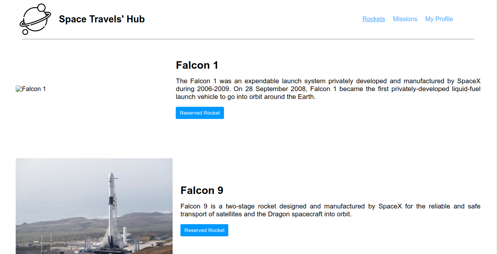
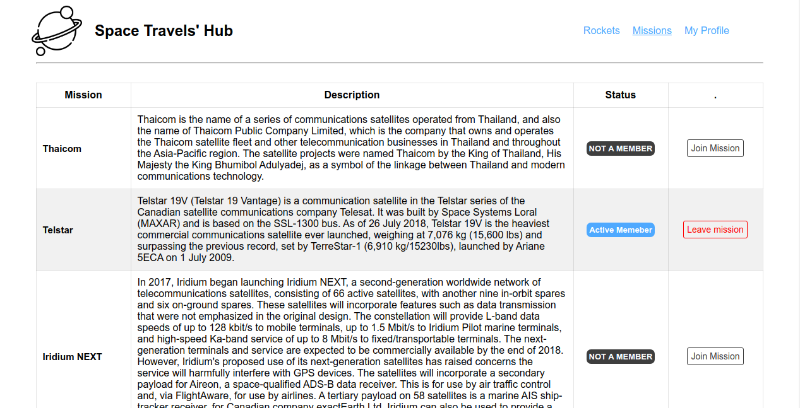

# Space Travel

> In this task, you will be working with the real live data from the SpaceX API. Your task is to build a web application for a company that provides commercial and scientific space travel services. The application will allow users to book rockets and join selected space missions.




## Build with

- React

## Getting Started

### Prerequisites

You need to have a browser and this tools installed:

- git
- Node

### Setup

To get a local copy up and running follow these simple example steps:

```
$ git@github.com:daudi13/space-travel.git

```

```
$ cd space-travel
```

```
$ npm i
```

```
$ npm start
```

### Usage

To build the production version:

```
$ npm run build
```

## Authors

👤 **Ismail Courr**

- GitHub: [@ismailco](https://github.com/ismailco)
- Twitter: [@ismailcourr](https://twitter.com/ismailcourr)
- LinkedIn: [Ismail Courr](https://linkedin.com/in/ismailcourr)

👤 **David Ouma**

- GitHub: [@daudi13](https://github.com/daudi13)
- Twitter: [@davouma](https://twitter.com/davouma)
- LinkedIn: [David Ouma](https://www.linkedin.com/in/david-ouma-3a3539179/)

## 🤝 Contributing

Contributions, issues, and feature requests are welcome!

Feel free to check the [issues page](../../issues/).

## Show your support

Give a ⭐️ if you like this project!

## 📝 License

This project is [GPL-3.0](./LICENSE) licensed.
